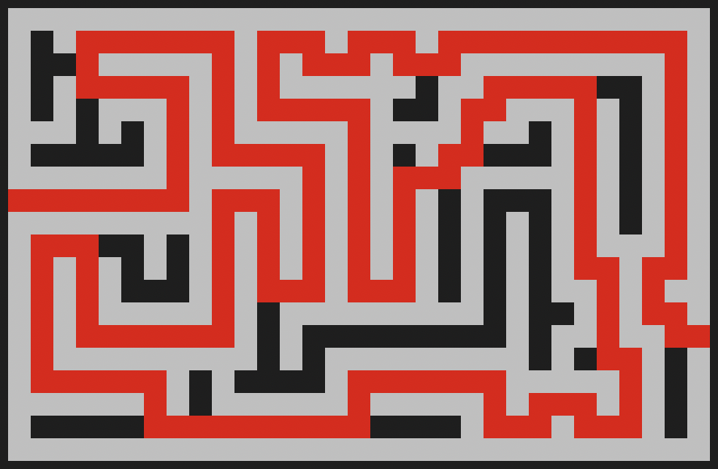

# Maze Solver

<div align="center">
    <p>
        
        &nbsp;&nbsp;&nbsp;&nbsp;&nbsp;
        
<br>This repository contains an implementation of a recursive maze solving algorithm
    </p>

</div>

## Maze File Format
In a text file, create a maze with that uses the following format:
- The file begins with two comma-seperated integers representing the maze dimensions in {WIDTH},{HEIGHT}
- The file then has a blank line followed by the maze diagram
- The walls of the maze are represented using the '#' character
- The starting position of the maze is located on the far-left column

For example (`maze1.txt`):

```
10,7

##########
#        #
### ### ##
  # # #  #
# # # # ##
#     #   
##########
```

## Usage
1. Clone the repo and navigate to its top level
```
git clone git@github.com:TomRaynes/Maze-Solver.git
cd Maze-Solver
```
2. Compile the code
```
gcc maze_solver.c -o maze_solver
```
3. Pass the maze file as an argument to the maze_solver executable
```
./maze_solver maze.txt
```